.. _rvtools:

-------
Lab - Analyzing RVTools Data
-------

Overview
--------

RVTools is a free Windows .NET application which uses the VI SDK to collect information about virtual machines and ESXi hosts. RVTools is capable of exporting a complete inventory of a vSphere environment along with point-in-time utilization data.

.. note::

	While RVTools only supports VMware environments, similar reports can be generated for other hypervisors using alternate tools.

	For Hyper-V, see `Hyper-V Reporting Script <https://gallery.technet.microsoft.com/scriptcenter/Hyper-V-Reporting-Script-4adaf5d0>`_.

	For XenServer, `export Resource Data <https://docs.citrix.com/en-us/xencenter/6-5/xs-xc-pools/xs-xc-pools-export-data.html>`_ using XenCenter.

Running RVTools
---------------

Download the `RVTools Installer <https://www.robware.net/rvtools/download/>`_.

Launch the RVTools Installer and complete the installation wizard.

Launch RVTools and provide the following:

- vCenter IP Address/FQDN
- Username with read access to all vCenter resources
- Password

RVTools will collect a complete inventory and display on screen.

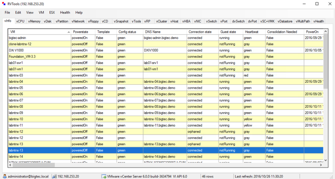

Select **File > Export all to Excel**.

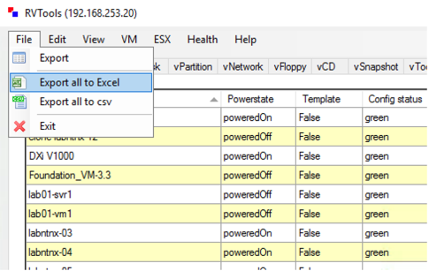

Select a directory and click **Save**.

Basic Analysis Tips
-------------------

A standard RVTools export is comprised of many tabs, including vInfo, vCPU, vMemory, vDisks, vPartitions, vHosts, vNetwork, vCD, vFloppy, etc. All have interesting information but not all are useful in sizing.  You can hide or just ignore tabs that aren’t needed.

Similarly, each tab contains many non-essential columns that can be hidden or deleted. The remainder of this guide will focus on the essential data, with additional data already removed.

Exports often contain multiple clusters and you will want address each cluster as an independent workload or collection of workloads. This holds true even if you are consolidating multiple clusters into a single Nutanix cluster. This will ensure you right-size for things like vCPU:pCpu core ratio.

Add range data on each tab into a table to easily sort and filter. Select the desired tab in Excel and click **Insert > Table**. Ensure **My table has headers** is selected and click **OK**.

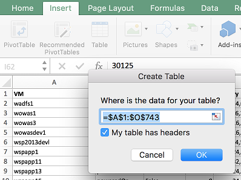

The information most relevant to sizing can be extracted from three tabs:

- vInfo
- vPartition
- vDisk
- vHost

You can remove/hide unnecessary columns like config status, DNS name, heartbeat, etc. to make it easier to navigate.
Make sure to pay attention to the description and annotation fields. These columns can be helpful in identifying mission critical systems and specific applications.

**Additional sizing items to be aware of (covered in detail following):**

- Separate out clusters.
- MB is actually MiB. MiB conversions to GiB/TiB - covered in detail in lab, but remember that when converting you are dividing or multiplying by 1024, not 100. In smaller configs, this is usually inconsequential, but in builds with large memory or storage requirements this can significantly change the results of a sizing.
- Divide up into different workloads based on DR requirements.
- Account for templates or powered off VMs. (Verify with customer if you should consider those VMs in the sizing)
- Check to see if the customers existing VMs are thick or thinly provisioned. If thick, are they going to stay that way or change? (With Nutanix, we thin provision by default)
- RVTools is run at a single point in time, not over a period in time. (Keep that in mind as it may not have been done during Peak performance)
- Replication and snapshot calculations are done on a workload basis within sizer to account for specific data protection requirements.
- Add memory consumed by VMs to your total storage requirements to account for things like vSwap.
- Verify the customers existing environment is already configured for N+1 host failure. (If not, make sure to put into consideration in your sizing)

vInfo
-----

**vInfo** provides a summary of all VMs and their core specifications, including vCPUs, Memory, Provisioned Storage, Host, Cluster, and more.

Open your RVTools spreadsheet and, as previously covered, create a table in Excel from the **vInfo** tab.

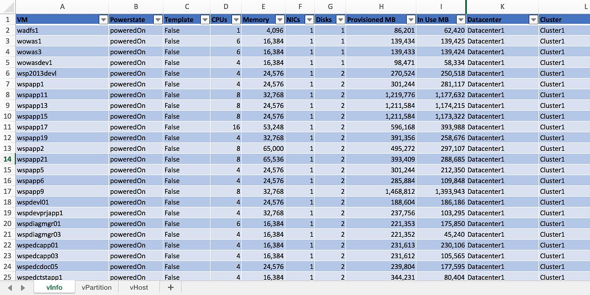

Next, in the **Cluster** column, select the **Filter** icon and select the desired cluster.

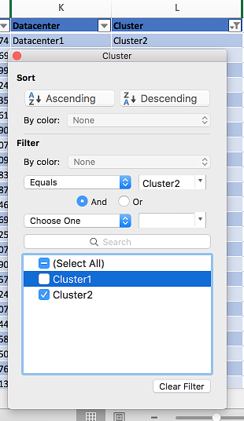

**Cluster** - Cluster2

In the **Template** column, select the **Filter** icon and select **False**. This will filter out vCPU and Memory related to VMs that will never be powered on.

.. note::

	You should perform a quick filter of **poweredOff** VMs in the **Powerstate** to determine how many powered off VMs there are in the cluster. Typically a few powered off VMs will have negligible impact on the sizing, but if there are many powered off VMs it is worth performing additional discovery with the customer.

	*Do they plan to power these VMs on at any point?* If yes, include the VMs from both a vCPU, memory, and storage perspective in your sizing.

	*Are they simply templates not flagged as templates?* If yes, the VMs don't need to count towards vCPUs and memory, but you should still account for storage.

	*Are these VMs not going to be migrated to Nutanix?* If yes, they can be filtered out of the sizing analysis entirely.

	**Using the "Import RVTools" feature within Nutanix Sizer will ignore ALL PoweredOff VMs entirely. If using this feature for simple environments it is critical to manually account for any powered off VMs.**

.. note::

	You can also filter against the **CPUs** column for VMs with > 8 vCPUs to identify any potential mission critical workloads that should be flagged and sized as a separate workload. The reason for sizing these VMs separately is so Sizer can properly account for differences in vCPU:pCore ratio between general server workloads and workloads such as mission critical databases. Alternatively, these VMs may be Software Defined Storage controllers (e.g. Nutanix CVMs) that can be eliminated from the RVTools analysis.

	The **Description** or **Annotation** columns may provide additional information, but the best course of action is to follow-up with the customer to determine if additional care and attention should be paid to these VMs.

Select the **VM** column to determine the total number of VMs in the cluster. The total number of VMs will be equal to the **Count** value minus 1 (due to the header).

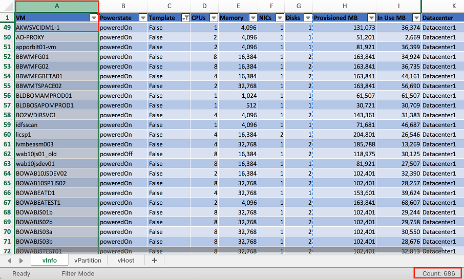

**Total VMs** - 685

Select the **CPUs** column to determine the **Sum** of all vCPUs in the cluster.

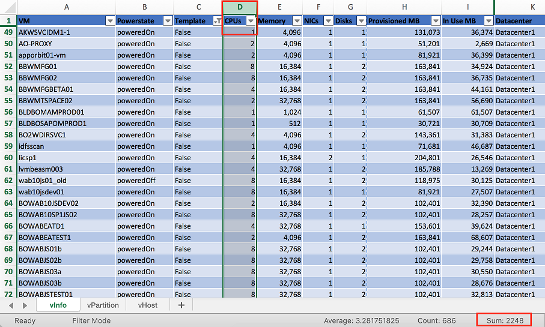

**Total vCPUs** - 2248

Select the **Memory** column to determine the **Sum** of all RAM assigned to VMs in the cluster. Divide by 1024 to calculate the amount of RAM in GiB.

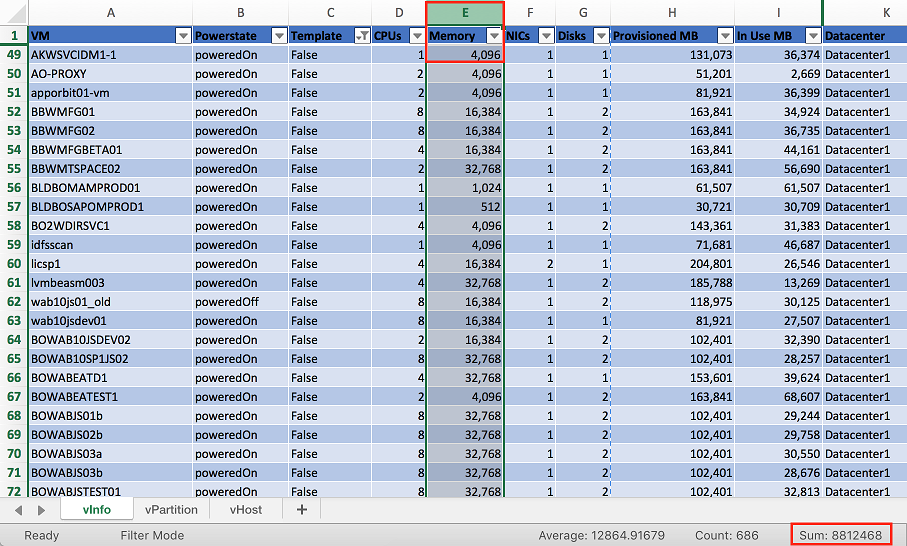

.. note::

RVTools labels its columns as MB (base 10) when in reality its MiB (base2).  Sizer asks for it's numbers in base 2, so no conversion is necessary unless you want to go between MiB, GiB, and TiB.

**Total Memory** - 8812468 MiB / 1024 = 8606 GiB

**Provisioned MB** represents the total storage space, in MiB, committed to a virtual machine across all datastores. **In Use MB** represents storage in use, in MiBs, used by this virtual machine on all datastores. **In Use MB** is the most conservative way to estimate storage requirements in sizer, It is a good reference point to start with, prior to looking deeper at actual consumed storage within the **vPartition** Tab.

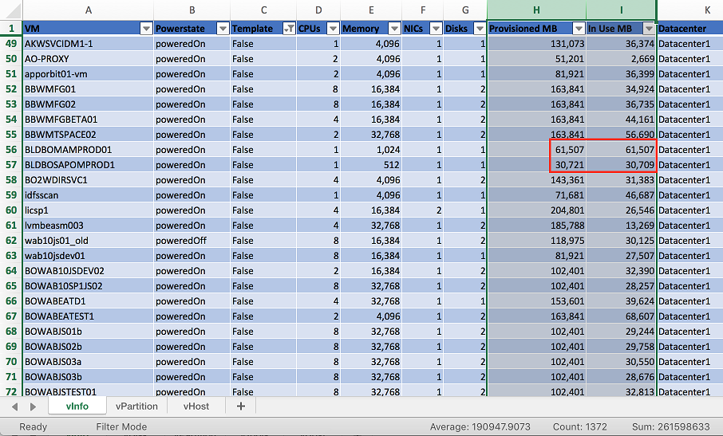

Use of Thick Provisioned virtual disks can quickly be determined via comparison of the **Provisioned MB** and **In Use MB** sums, similar or identical values indicate the use of Thick Provisioned disks. The **vDisk** tab also has a **Thin** column which provides a True/False value for each virtual disk. This is an important distinction to make and an important conversation to have with the customer.  Nutanix thin provisions by default, however if vSphere thick provisions,  Nutanix will honor that reservation, consuming more storage than is most likely necessary. If your customer is going to stay thick provisioned, then **In Use MB** is the proper storage number to use.

.. note::

	It is still worth noting the provisioned storage in an environment. Even though we typically size based on storage actually being utilized, the prospect may have additional factors impacting the available capacity required for a proposed solution.

vPartition
----------

**vPartition** provides in-guest storage utilization data provided by VMware Tools. This shows the impact of thin provisioning. Consumed MB is the space that the VM believes it has written to disk.  This is where knowing if a VM is thick or thin is important. If a customer is using thin already then this number is accurate to size from,  however if they are thick then Provisioned MB is the correct number.  You can often significantly reduce your storage requirements just by exposing to a customer that they are thick when they could be thin, however they must agree to convert thick to thin to take advantage.

.. note::

	VMware Tools is required to provide **vPartition** data. The **vTools** tab can be used to identify any VMs that do not have VMware Tools installed.

	VMs do not need to be powered on to provide **vPartition** data. If a VM is powered off, the host will provide the storage utilization data from when the VM was last powered on.

Create a table in Excel from the **vPartition** tab.

Next, in the **Cluster** column, select the **Filter** icon and select the desired cluster.

**Cluster** - **Cluster2**

Select the **Consumed MB** column to determine the **Sum** of all storage currently used in the cluster. Divide by 1024 to calculate the amount in GiB. Divide again by 1024 to calculate the amount in TiB.

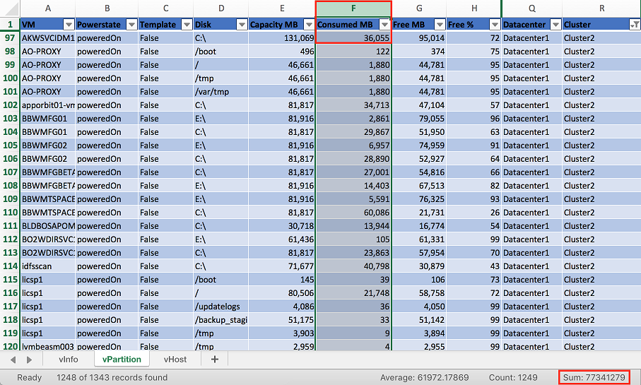

**In-Guest Consumed Storage** - 77341279 MiB / 1024 / 1024 = **73.8 TiB**

A final, and often forgotten, step is to factor in the storage requirement for swap files used for memory oversubscription. This additional amount of capacity should be equal to the amount of memory provisioned for VM workloads.

**Total Workload Storage** - 73.8TiB + (8606GiB / 1024) = **82.2TiB**

vHost
-----

**vHost** provides details regarding the compute hosts in the cluster, including CPUs, memory, vendor, and model.

Create a table in Excel from the **vHost** tab.

Next, in the **Cluster** column, select the **Filter** icon and select the desired cluster.

**Cluster** - **Cluster2**

.. note::

	In addition to the tabs we will evaluate, **vHost** provides **CPU Usage %** and **Memory Usage %** for each host. This data is collected at the point in time that RVTools was run, and is in no way a historical representation of utilization. It should therefore not factor into sizing.

	If a customer can provide additional anecdotal (peak CPU utilization doesn't exceed X%) or historical performance monitoring data, these can be factored in.

	Memory utilization is less relevant, as we size based on the amount of RAM provisioned to VMs with the assumption that memory is not being overcomitted.

	We typically size for the total potential CPU and Memory allocated to VMs.

Select the **# Cores** column to determine the **Sum** of all physical CPU cores (**pCores**) in the cluster.

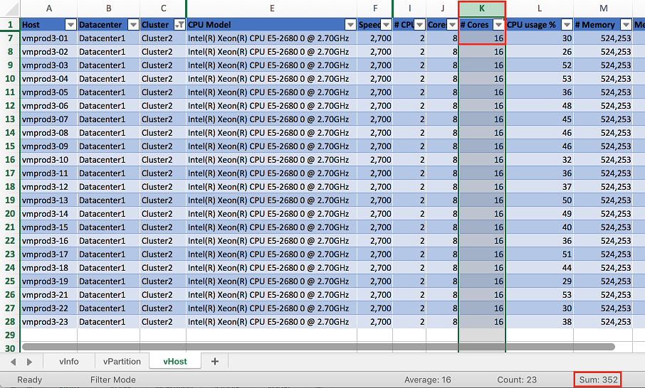

**Total pCores** - **352**

.. note::

	You will need to decide if you want to make the assumption that the cluster (physical hosts) you are gathering information from is already configured for N+1 redundancy or not. Sizer will automatically size for N+1 and report on your redundancy level. If the cluster you have gathered the information from is already N+1, you will oversize, and you may want to subtract 1 host worth of pCores from the **Total pCores** value.

	In this example, the total number of cores required to run the workload would be 336 Cores, rather than 352 Cores (each host has a total of 16 cores). This will have little impact for larger cluster sizes, but can make a dramatic difference in the vCPU:pCore ratio for clusters with a smaller number of hosts.

To calculate **vCPU:pCore Ratio**, divide the **Total vCPUs** by the **Total pCores**.

**vCPU:pCore Ratio** - 2248 / 352 = **6.4:1**

.. note::

	Common vCPU\:pCore ratios for general server virtualization typically range from 3:1-6:1.

	If the calculated ratio falls below this range, first perform some additional discovery with the customer regarding CPU utilization. If they agree they are currently under-utilizing CPU in their existing environment (or have additional historical monitoring data that shows this), you can justify using a higher, assumed ratio.

	Sizer currently defaults to a 6:1 vCPU:pCore ratio for Server Virtulization workloads. This ratio is not a hard standard. Always start by analyzing the data available.

Optionally, comparing existing **CPU Model** to targeted CPU model can also be used to increase vCPU:pCore ratio. Newer CPU models are capable of providing incrementally higher performance from a single core compared to previous generations, often even at lower clock speeds. This approach sees the most significant returns when comparing to CPUs that are several generations old.

Using a common CPU benchmark, such as the `Passmark Single Thread Benchmark <https://www.cpubenchmark.net/singleThread.html>`_, you can determine how much additional performance to expect on a per core basis.

The Intel Xeon E5-2680v1 processor has a Passmark Single Thread score of 1657.

Hypothetically, we will target the Intel Xeon Gold 6130 processor, which has a Passmark Single Thread score of 1952.

1952 / 1657 = **1.18x greater per core performance compared to the existing CPU model.**

**Adjusted vCPU:pCore Ratio** - 6.4:1 * 1.18 = **7.5:1**

Summary
-------

The collected values can now be summarized and used as Sizer inputs.

============ =========== ================ ============ =============
Cluster Name Total vCPUs vCPU:pCore Ratio Total Memory Total Storage
============ =========== ================ ============ =============
Cluster2     2248        6.4:1            8606 GiB     82.2 TiB
============ =========== ================ ============ =============
